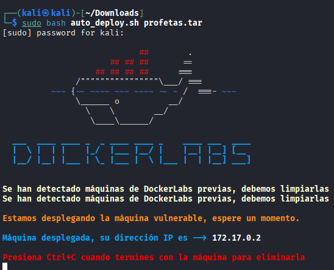

Tenemos la maquina Profetas nivel medio de DockerLabs

Tras ejecutar un comando ping y ver que tenemos conexio, la respuesta muestra un TTL=64. Este valor es característico de los sistemas basados en Unix/Linux, permitiéndonos identificar el sistema operativo del objetivo.

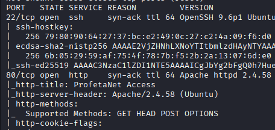

Ejecutamos nmap y observamos que la máquina tiene expuestos los puertos 22 y 80, lo que nos indica la presencia de un servicio de acceso remoto y un servidor web.

Nos dirigimos al navegador e ingresamos la IP del objetivo. Al encontrarnos con el panel de login, probamos la combinación clásica admin/admin y logramos entrar. Curiosamente, descubrimos que también se puede saltar la autenticación simplemente enviando el formulario vacío.

Explorando la web, notamos una cadena sospechosa en el pie de página que parecía estar en Base64. La copiamos y nos dirigimos a la terminal para descifrar su contenido y ver qué información ocultaba.

Tras decodificar la cadena en Base64, el resultado reveló el siguiente mensaje: 'la contrasena es tu usuario'. Esto confirma una política de contraseñas extremadamente débil o inexistente, donde la clave coincide con el nombre de cuenta del usuario.

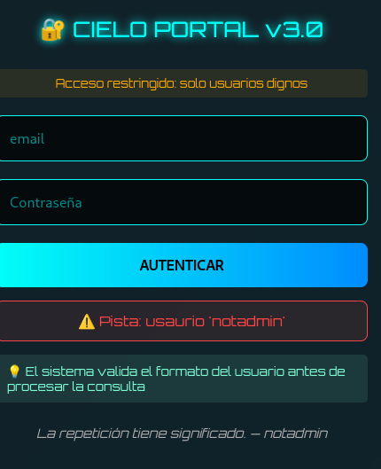

Donde teníamos el Base64, le damos a cerrar sesión y nos manda a este panel de login, en el cual nos pide email y contraseña. Ponemos unos al azar (yo puse prueba@gmail.com / prueba) y nos da una pista: 'usuario: notadmin'.

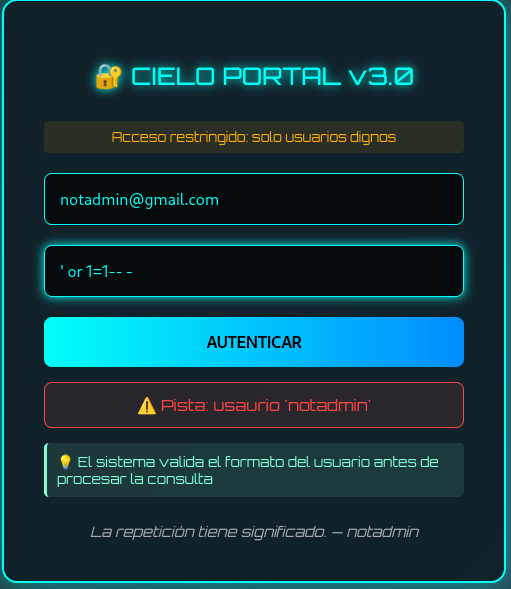

Probamos un ataque de SQL Injection en el panel de login. Como usuario pusimos notadmin@gmail y en la contraseña el payload ' or 1=1-- -. Con esto buscamos que la consulta lógica de la base de datos siempre resulte verdadera (True) y nos permita saltar la autenticación.

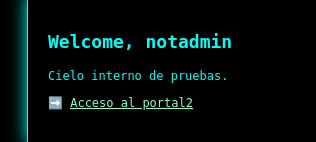

Damos acceso al portal

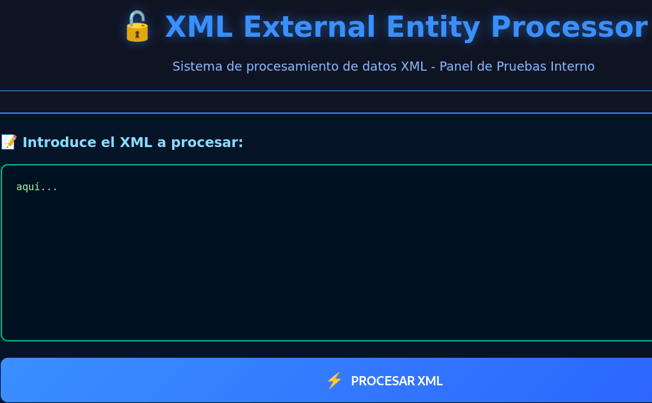

Tenemos un panel de xml

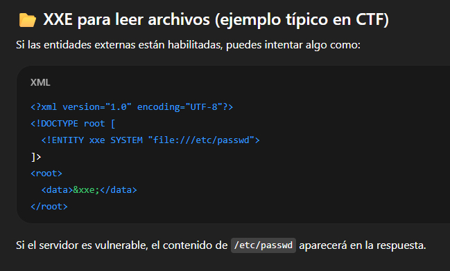

procedemos a investigar un XXE injection

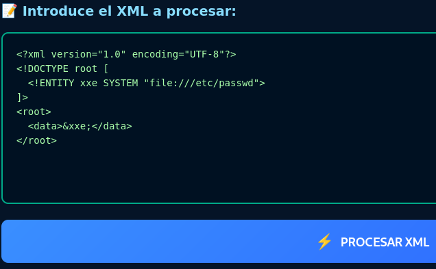

pegamos el XXE en el panel Xlm

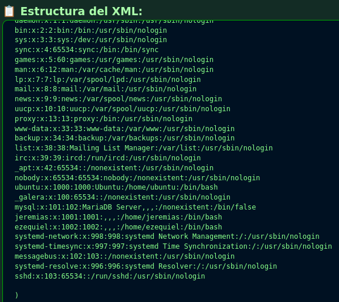

Vemos que tenemos el usuario jeremias y ezequiel

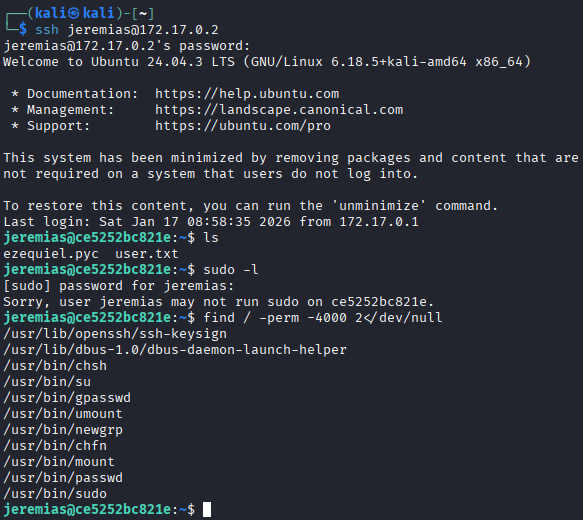

Procedemos a entrar por SSH a la cuenta de jeremias, utilizando las credenciales jeremias:jeremias (basándonos en la pista del Base64). Una vez dentro, ejecutamos sudo -l para verificar privilegios, pero no obtenemos resultados. Posteriormente, buscamos binarios con permisos SUID mediante el comando find / -perm -4000 2>/dev/null, aunque no hallamos nada interesante. Sin embargo, localizamos un archivo llamado ezequiel.pyc, el cual transferimos a nuestra máquina anfitriona utilizando la herramienta croc.

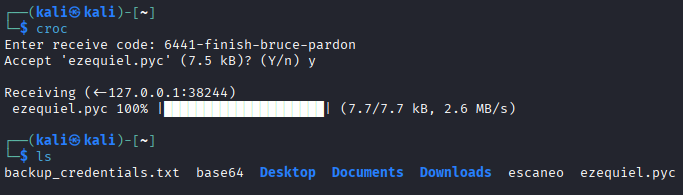

Recibimos el archivo ezequiel.pyc en la máquina anfitriona. Una vez transferido, procedemos a su análisis para intentar recuperar el código fuente original mediante herramientas de descompilación.

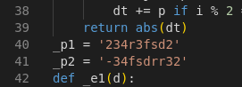

Utilizamos el servicio de Pylingual.io para descompilar el archivo ezequiel.pyc. Al analizar el código fuente recuperado, identificamos dos variables sospechosas: _p1 (234r3fsd2) y _p2 (-34fsdrr32). Al concatenar ambos valores, obtuvimos la contraseña completa para el usuario ezequiel.

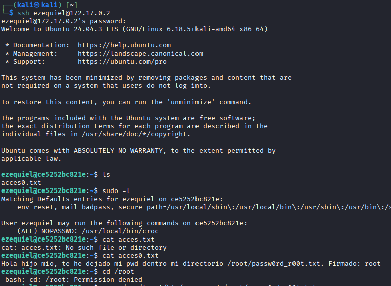

Accedemos por SSH a la cuenta de ezequiel utilizando las credenciales obtenidas (ezequiel : 234r3fsd2-34fsdrr32). Al listar el directorio personal, localizamos un archivo llamado acces0.txt con el siguiente mensaje: 'Hola hijo mío, te he dejado mi pwd dentro de mi directorio /root/pass0rd_r00t.txt'. Intentamos acceder directamente al directorio /root/, pero el sistema deniega el acceso debido a la falta de privilegios.

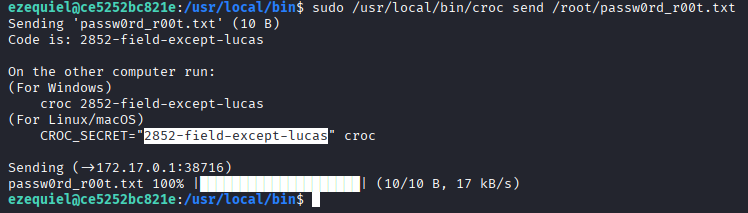

Utilizamos croc para pasar el pass0rd_r00t.txt a la maquina anfitrion

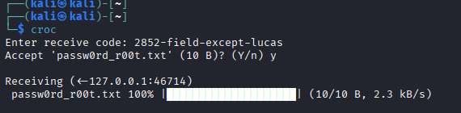

Recivimos en maquina anfitrion con croc

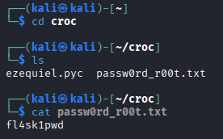

Para mantener la organización de los artefactos obtenidos, creamos una carpeta denominada croc, donde almacenamos los archivos ezequiel.pyc y pass0rd_r00t.txt. Al visualizar el contenido de este último mediante el comando cat, logramos extraer la contraseña de root compartida con el usuario ezequiel: fl4sk1pwd.

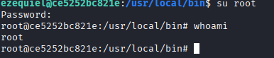

Finalmente, regresamos a la sesión del usuario ezequiel y ejecutamos el comando su root. Tras introducir la contraseña obtenida (fl4sk1pwd), logramos escalar privilegios con éxito, obteniendo acceso total como superusuario (root) en la máquina objetivo."
:)))))))))))
